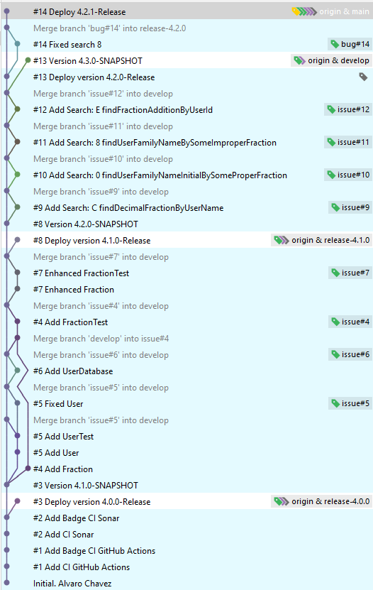

## [Máster en Ingeniería Web por la Universidad Politécnica de Madrid (miw-upm)](http://miw.etsisi.upm.es)
## Ingeniería Web: Visión General (IWVG) DevOps
> Este proyecto esta basado en una plantilla de apoyo docente de la asignatura.
### Proyecto base
- [miw-upm/iwvg-devops](https://github.com/miw-upm/iwvg-devops/tree/develop)

### Estado del código

### Autor de los cambios

- [Álvaro Fernando Chávez](https://github.com/Nemn120)

### Tecnologías necesarias
`Java` `Maven` `GitHub` `GitHub Actions` `Sonarcloud` `Spring-boot`

### Tareas desarrolladas
#### 1. Crear un proyecto 
#### 2. Preparar la gestión de Scrum
- [Proyecto](https://github.com/users/Nemn120/projects/3)
- [Milestone](https://github.com/Nemn120/iwvg-devops-chavez-alvaro/milestones)
#### 3. Sprint 1. Preparación del ecosistema
- [GitHubActions](https://github.com/Nemn120/iwvg-devops-chavez-alvaro/actions/workflows/ci.yml)
- [SonarCloud](https://sonarcloud.io/project/overview?id=master-en-ingenieria-web_iwvg-devops-chavez-alvaro)
#### 4. Releases y Tags
- [Ramas](https://github.com/Nemn120/iwvg-devops-chavez-alvaro/branches)
- [Tags](https://github.com/Nemn120/iwvg-devops-chavez-alvaro/tags)
#### 5. Desarrollo de Issues
